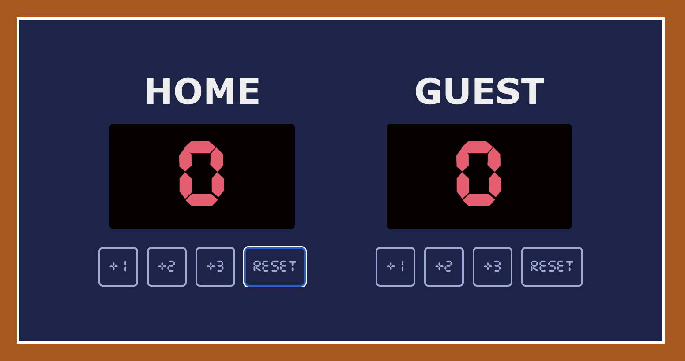

# Basketball Scoreboard

Scrimba.com - Front End Developer Career Path

Project: Basketball Scoreboard

Technologies Used: HTML, CSS & Javascript

Introduction: This is my first solo project using html, css & javascript. The aim is to create a basketball scoreboard that keeps score for two teams. Each team has three buttons to increment the score by one, two and three points.

## Live Preview: https://xandrom3dax.github.io/basketball-scoreboard/

## Screenshots

## Lessons Learned

What did you learn while building this project? What challenges did you face and how did you overcome them?

1. I learnt how to work with local font files.
2. I increased my competence when using JS functions.
3. It's the first time I used Figma to interpret the design.
